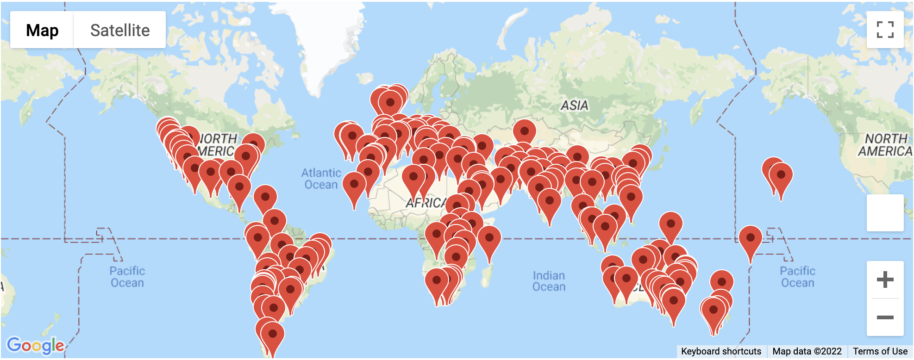
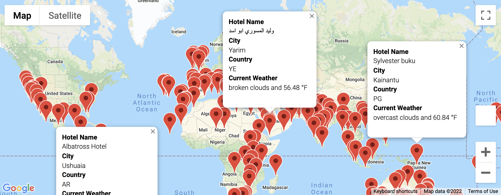
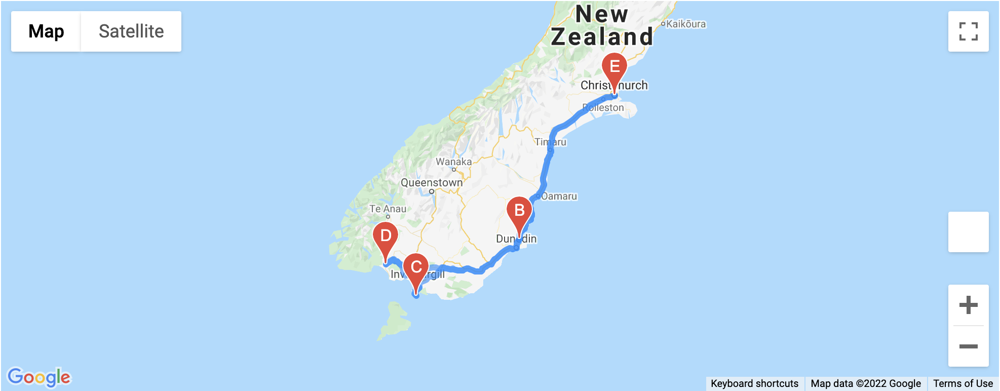
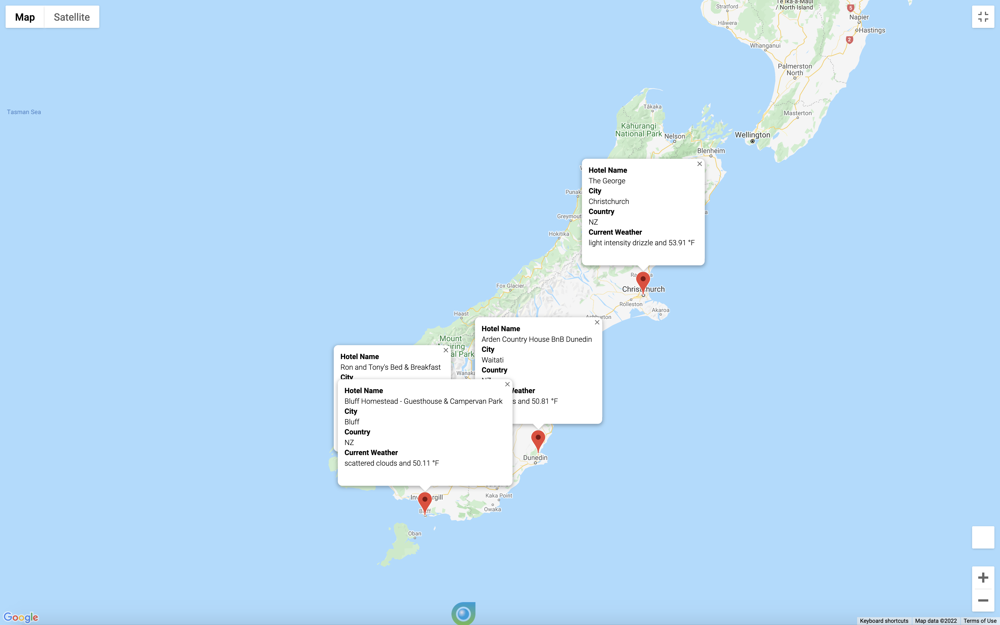

# World_Weather_Analysis

### Resources
Python 3.7.11
Conda 4.11.0

## Process

### Step 1: Retrieve Weather Data
1. Generate 2000 random latitude and longitude combinations and find the nearest city using the citypy module
2. Using the OpenWeatherMap API, retrieve current weather data for each city.
    - Latitude and Longitude
    - Maximum Temperature
    - Percent Humidity
    - Percent Cloudiness
    - Wind Speed
    - Weather Description (e.g. clouds, fog, light rain, clear sky, etc)
3. Add the data to a new DataFrame
4. Export data to a CSV [WeatherPy_Database.csv](Weather_Database/WeatherPy_Database.csv)

##### Full Code Found Here: [Weather_Database.ipynb](Weather_Database/Weather_Database.ipynb)

### Step 2: Create a Custom Travel Destinations Map
1. Import the CSV file created in Step 1 as a DataFrame
2. Gather user input for desired minimum and maximum temperature criteria for their vacation
3. Filter the DataFrame based on the desired temperature
4. Using Google Directions API to search for lodging in each city and store the first result in the Hotel Dataframe.
5. Export this DataFrame into a CSV file for future use [WeatherPy_Vacation.csv](Vacation_Search/WeatherPy_vacation.csv)
6. Create a Google Map with a Marker Layer, with a marker at the location of each hotel.

##### Full Code Found Here: [Vacation_Search.ipynb](Vacation_Search/Vacation_Search.ipynb)

##### WeatherPy_vacation_map

##### WeatherPy_vacation_map_with_popups
 

### Step 3: Create a Travel Itinerary Map
Using the Google Directions API, create a travel itinerary that shows the route between four cities chosen from the customer's possible travel destinations. Then, create a marker layer map with a pop up marker for each city on the itineerary.
1. Import the CSV Data from Step 2 into a DataFrame.
2. Create a marker layer map of the vacation search results, and use it to choose four cities in one country that a customer might want to visit.
3. Use the loc method to create dataframes for each city on the travel route, then to_numpy() function to retrieve the latitude and longitude pairs from each city DataFrame.
4. Use the google maps directions layer to visualize the travel route.
5. Create a marker layer with pop-up markers for each city showing the hotel, city, country, and current weather. 

##### Full Code Found Here: [Vacation_Itinerary.ipynb](Vacation_Itinerary/Vacation_Itinerary.ipynb)

##### WeatherPy_travel_map

##### WeatherPy_travel_map_markers

